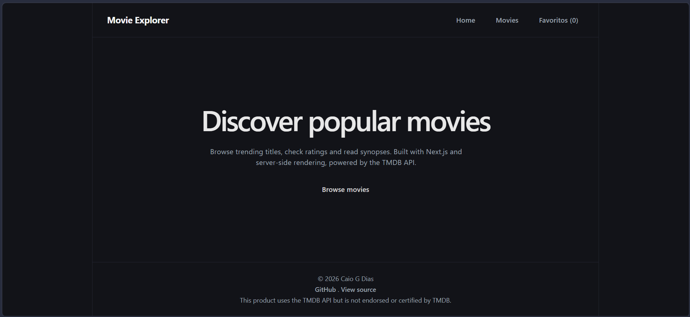
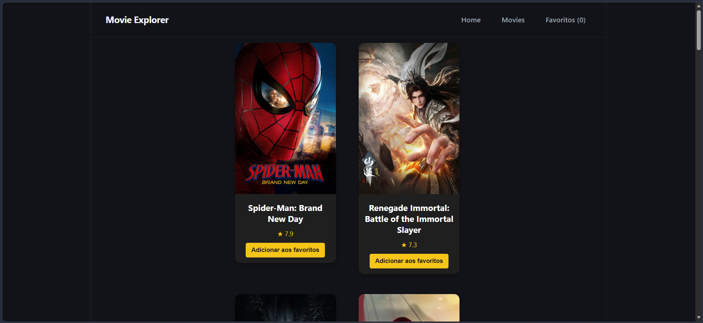
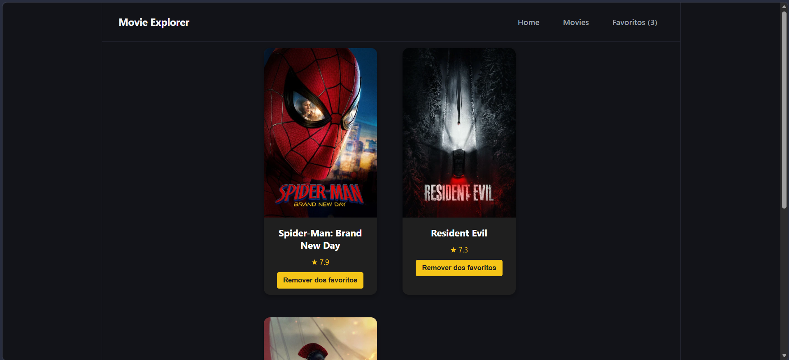

# Movies SPA

A single-page movie browser built with React and Vite, powered by [The Movie Database (TMDB)](https://www.themoviedb.org/) API.

**Live demo:** https://movies-spa-six.vercel.app

## Screenshots







## Features

- Browse popular movies in a card grid, each with poster, title and rating
- Movie details page with poster and synopsis
- Favorites tab: save and remove movies, with state managed by Redux
- Prefetching: movie data starts loading when you hover a card, so the details page opens faster
- Server-state caching with React Query, avoiding repeated requests

## Tech stack

- **React** + **Vite**
- **Redux** for favorites state
- **React Query** for data fetching, caching and prefetching
- **Axios** for HTTP requests
- **Jest** for unit tests
- Deployed on **Vercel**

## Getting started

```bash
git clone https://github.com/caiogd20/Movies-spa.git
cd Movies-spa
npm install
cp .env.example .env   # then fill in your TMDB credentials
npm run dev
```

You can get a free API key at [themoviedb.org](https://www.themoviedb.org/settings/api).

## Scripts

| Command | Description |
| --- | --- |
| `npm run dev` | Start the development server |
| `npm run build` | Create a production build |
| `npm test` | Run the unit tests |

## Credits

This product uses the TMDB API but is not endorsed or certified by TMDB.